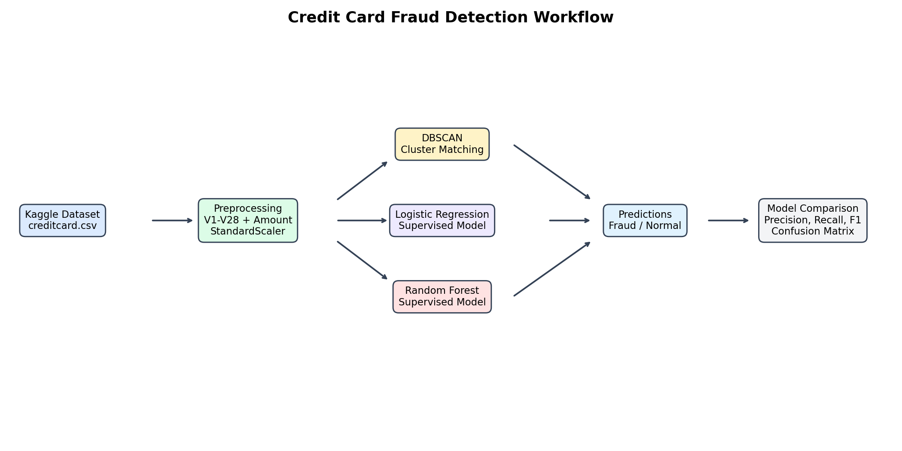
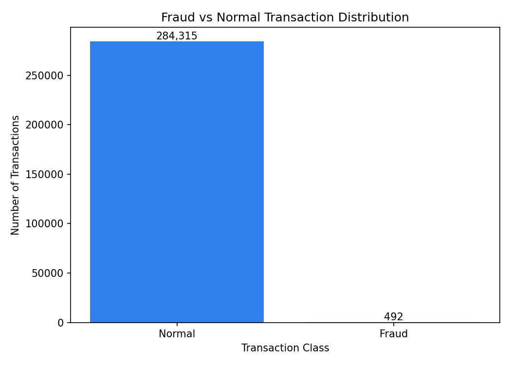
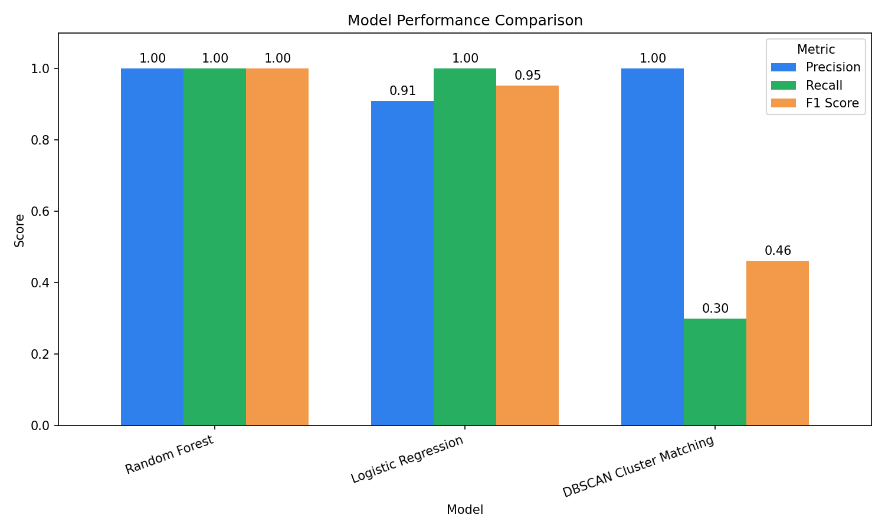
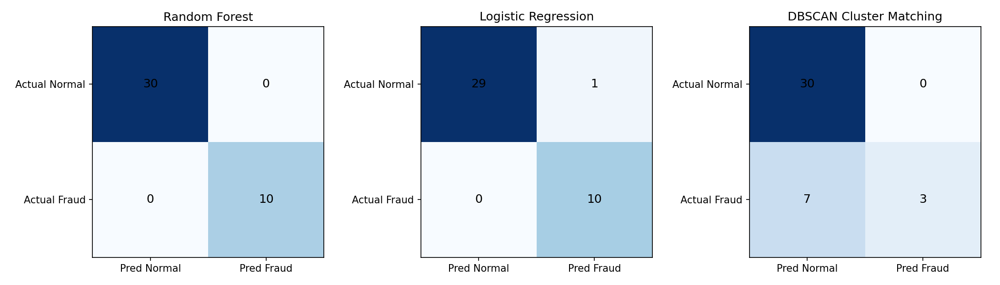

# Credit Card Fraud Detection: DBSCAN vs Supervised Models

A machine learning project for detecting fraudulent credit-card transactions using both unsupervised and supervised approaches. The project starts with DBSCAN cluster matching, then compares it against Logistic Regression and Random Forest on a labeled evaluation sample.

The goal is to show a complete fraud-detection workflow: data preparation, model training, prediction, evaluation, visualization, and model comparison



## Project Highlights

- Built an end-to-end ML workflow using Python and scikit-learn
- Used the Kaggle Credit Card Fraud Detection dataset
- Implemented DBSCAN cluster matching for unsupervised fraud detection
- Trained Logistic Regression and Random Forest supervised classifiers
- Compared all three methods using precision, recall, F1-score, and confusion-matrix values
- Generated visual reports for class imbalance, model metrics, and confusion matrices
- Organized outputs, models, scripts, and charts in a GitHub-ready project structure

## Dataset

Dataset: [Kaggle Credit Card Fraud Detection](https://www.kaggle.com/datasets/mlg-ulb/creditcardfraud)

The dataset contains anonymized transaction features:

- `Time`
- `V1` to `V28`
- `Amount`
- `Class`

Target variable:

- `0` = Normal transaction
- `1` = Fraud transaction

The original dataset is highly imbalanced:

```text
Normal    284315
Fraud        492
```



## Methods Used

### 1. DBSCAN Cluster Matching

DBSCAN is used to cluster historical transactions. Clusters with enough fraud cases and high fraud rate are treated as fraud-dominant clusters. New transactions are scaled and matched to the nearest saved historical cluster profile.

### 2. Logistic Regression

Logistic Regression is trained as a supervised baseline using class balancing. It learns directly from the labeled fraud and normal transactions.

### 3. Random Forest

Random Forest is trained as a supervised ensemble model. It performed best on the current evaluation sample.

## Results

Model comparison on the sampled evaluation set:

| Model | Precision | Recall | F1 Score | TN | FP | FN | TP |
| --- | ---: | ---: | ---: | ---: | ---: | ---: | ---: |
| Random Forest | 1.0000 | 1.0000 | 1.0000 | 30 | 0 | 0 | 10 |
| Logistic Regression | 0.9091 | 1.0000 | 0.9524 | 29 | 1 | 0 | 10 |
| DBSCAN Cluster Matching | 1.0000 | 0.3000 | 0.4615 | 30 | 0 | 7 | 3 |

Best performing model:

```text
Random Forest
```

The supervised models outperformed DBSCAN because they directly learned from labeled fraud examples. DBSCAN remained useful as an unsupervised baseline, but it missed more fraud cases.





## Project Structure

```text
fraud detection ml/
|-- data/
|   |-- raw/
|   |   |-- creditcard.csv
|   |   `-- new_transactions.csv
|   `-- processed/
|       |-- creditcard_clustered.csv
|       |-- fraud_predictions.csv
|       |-- supervised_predictions.csv
|       `-- model_comparison.csv
|-- models/
|   |-- scaler.pkl
|   |-- cluster_profiles.pkl
|   |-- supervised_scaler.pkl
|   |-- supervised_feature_columns.pkl
|   |-- logistic_regression_model.pkl
|   `-- random_forest_model.pkl
|-- reports/
|   `-- figures/
|       |-- workflow_diagram.png
|       |-- fraud_distribution.png
|       |-- model_metrics_comparison.png
|       `-- model_confusion_matrices.png
|-- src/
|   |-- __init__.py
|   |-- compare_models.py
|   |-- config.py
|   |-- data_utils.py
|   |-- predict.py
|   |-- predict_supervised.py
|   |-- train.py
|   |-- train_supervised.py
|   `-- visualize.py
|-- .gitignore
|-- requirements.txt
`-- README.md
```

## Installation

Clone the repository and open it in VS Code.

Create a virtual environment:

```bash
python -m venv .venv
```

Activate it on Windows PowerShell:

```bash
.\.venv\Scripts\Activate.ps1
```

Install dependencies:

```bash
pip install -r requirements.txt
```

## Data Setup

Download `creditcard.csv` from Kaggle and place it here:

```text
data/raw/creditcard.csv
```

Create `new_transactions.csv` from a small sample of Kaggle rows and place it here:

```text
data/raw/new_transactions.csv
```

For model comparison, keep the `Class` column in `new_transactions.csv` so the script can calculate metrics.

## How To Run

Train DBSCAN and save cluster profiles:

```bash
python -m src.train
```

Predict using DBSCAN cluster matching:

```bash
python -m src.predict
```

Train Logistic Regression and Random Forest:

```bash
python -m src.train_supervised
```

Predict using Logistic Regression and Random Forest:

```bash
python -m src.predict_supervised
```

Compare all three models:

```bash
python -m src.compare_models
```

Generate charts:

```bash
python -m src.visualize
```

## Generated Outputs

Prediction files:

```text
data/processed/fraud_predictions.csv
data/processed/supervised_predictions.csv
data/processed/model_comparison.csv
```

Saved model artifacts:

```text
models/scaler.pkl
models/cluster_profiles.pkl
models/supervised_scaler.pkl
models/supervised_feature_columns.pkl
models/logistic_regression_model.pkl
models/random_forest_model.pkl
```

Charts:

```text
reports/figures/workflow_diagram.png
reports/figures/fraud_distribution.png
reports/figures/model_metrics_comparison.png
reports/figures/model_confusion_matrices.png

```
## outputs

###supervised models


###dbscan 


## Key Configuration

Main settings are stored in `src/config.py`:

```python
DBSCAN_EPS = 2
DBSCAN_MIN_SAMPLES = 5
FRAUD_CLUSTER_MIN_COUNT = 5
FRAUD_CLUSTER_MIN_RATE = 0.50
MATCH_DISTANCE_MULTIPLIER = 1.25
NORMAL_SAMPLE_SIZE = 5000
RANDOM_STATE = 42
RANDOM_FOREST_ESTIMATORS = 100
```

## Important Notes

- The Kaggle CSV and generated `.pkl` model files are ignored by Git because they can be large.
- DBSCAN is unsupervised and does not provide a native `predict` method, so this project uses saved historical cluster profiles for matching.
- The evaluation shown here uses a small labeled sample in `new_transactions.csv`; results may change with a larger or different evaluation set.
- For production fraud detection, supervised models should be validated on a proper train-validation-test split and monitored for data drift.

## Skills Demonstrated

- Python project organization
- Data preprocessing
- Unsupervised learning with DBSCAN
- Supervised classification with Logistic Regression and Random Forest
- Handling imbalanced fraud data
- Model evaluation using precision, recall, F1-score, and confusion matrices
- Visualization with matplotlib
- Git and GitHub project documentation

## References

- [Kaggle Credit Card Fraud Detection Dataset](https://www.kaggle.com/datasets/mlg-ulb/creditcardfraud)
- [DBSCAN in scikit-learn](https://scikit-learn.org/stable/modules/generated/sklearn.cluster.DBSCAN.html)
- [Logistic Regression in scikit-learn](https://scikit-learn.org/stable/modules/generated/sklearn.linear_model.LogisticRegression.html)
- [Random Forest in scikit-learn](https://scikit-learn.org/stable/modules/generated/sklearn.ensemble.RandomForestClassifier.html)
